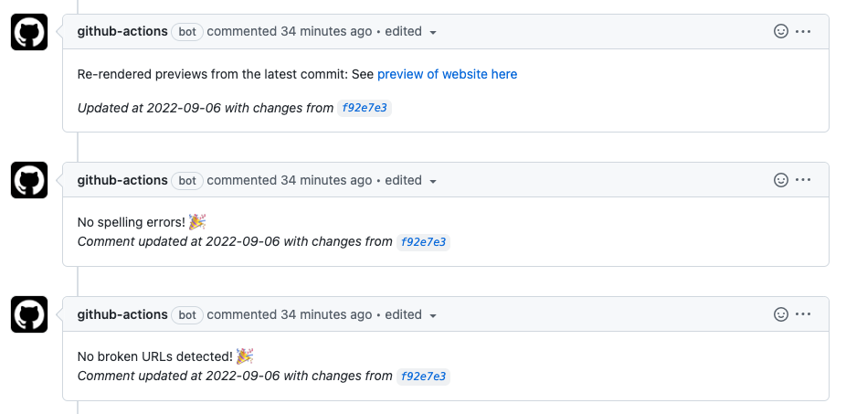

We have set up several checks for website content edits.

When you create a pull request, you will see something like this if everything is successful. You can click on the `preview of the wbsite here` link to see a preview. Please note that some features may not be possible to see in the preview. For example, icons may only show up as a box.

```{r, fig.align='center', fig.alt= "PR checks", echo = FALSE, out.width="70%"}

```
## Rendering Action


## Spelling and Style Action

You may find that you have spelling errors if you get the following message from your pull request (PR):

```{r, fig.align='center', fig.alt= "spelling issue PR image", echo = FALSE, out.width="80%"}
knitr::include_graphics("resources/images/spelling.png")
```

If this happens, click the "Download the errors here." link. This will take you to a table with words that the check thought were misspelled, as well as what file they occurred in and the lines in that file.

Add words that are not actually misspelled to the `dictionary.txt` file located in the `resources` directory. It's a good idea to try to keep this in alphabetical order.

For words that are indeed misspelled, fix the errors and push your changes to your PR. 

You should then see that your PR has a different message that tells you that you have no spelling errors.

## URL Check

You may find that you have broken URLs. If so you will get this message when you create a Pull Request.

```{r, fig.align='center', fig.alt= "URL issue PR image", echo = FALSE, out.width="80%"}
knitr::include_graphics("resources/images/url_check.png")
```
You can click on the `Download the errors here` link to see a document with a list of broken URLs and what files they are located in, like this:

```{r, fig.align='center', fig.alt= "broken url list", echo = FALSE, out.width="80%"}
knitr::include_graphics("resources/images/urls.png")
```

Here we can see that there are two URLs that are broken in the `git_actions.Rmd` file.

## Completing a Pull Request

Once all the Git Action checks pass, you can merge your PR to your main branch for your website.

```{r, fig.align='center', fig.alt= "finishing a PR", echo = FALSE, out.width="80%"}
knitr::include_graphics("resources/images/checks2.png")
```

If you are only working on this yourself without others you can click the `Merge without waiting for requirements to be met` box, so that you can click the `Merge pull request` button. 


